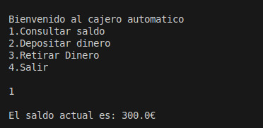
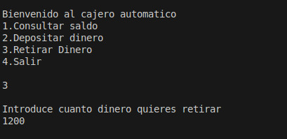

# Proyecto de Cajero Automatico

## Descripción

*Bienvenidos a nuestro proyecto. Consistira en un cajero automático hecho en Java donde se podrá ingresar dinero retirar dinero y ver cuanto saldo hay disponible. Al salir del cajero se mostraran estadisticas de cuantos ingresos y retiros ha habido y el importe total de ambos-*

## Integrantes

*Lourdes Molina Caselles*
*Emilio José De la Fuente Soto*
*José Manuel Cano González*

## Instrucciones de uso

*Al ejecutar el código lo primero que vemos es un menú donde podemos escoger la opción que queramos*

**Función de agregar el dinero**

*Para ingresar dinero pulsamos la opción 2, el programa nos pedira cuantos queremos ingresar le decimos la cantidad y al final nos dirá cuantos hemos ingresado.*

**Función de retirar el dinero**

*Para retirar el dinero elegimos la opción 3 el cajero no se podrá quedar a 0 por lo tanto solo podremos retirar una parte ejemplo si tenemos 1500 ingrsados podemos retirar hasta 1490 pero los 1500 no porque no podemos retirar dinero que no hay ingresado.*

**Función de consultar saldo**
*Para consultar el saldo pulsaremos la opción 1 y nos dará la información del saldo que tenemos disponible.*

**Consulta de estadísticas**

*Para consultar las estadisiticas de cuanto hemos ingresado, cuanto hemos retirado y ver cuantas veces se ha ingresado y retirado dinero pulsamos la opción 4*

